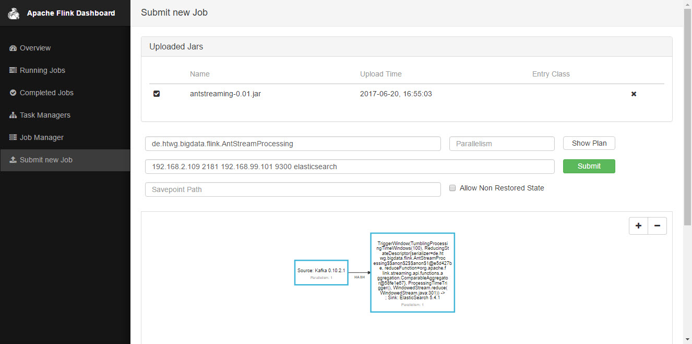
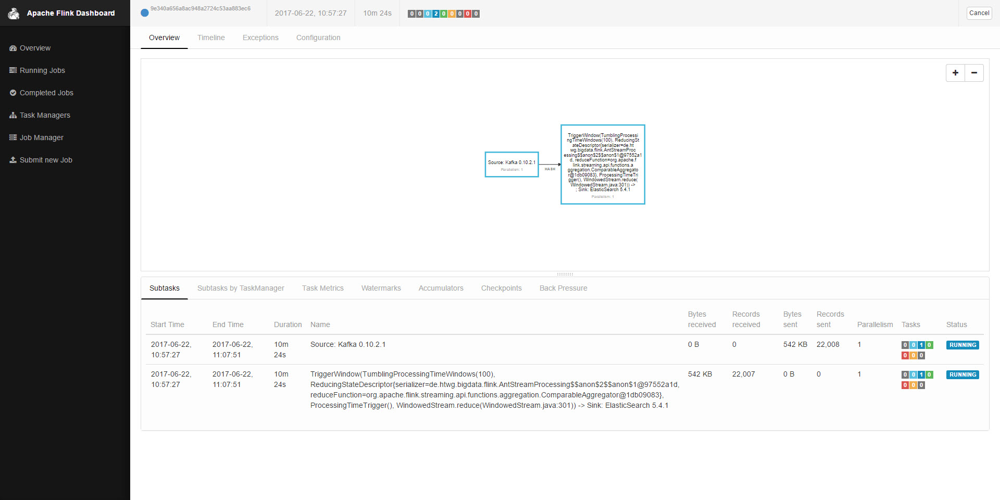

## creation of docker swarm manager and worker nodes

1. create kibana plugin folder 
2. replace volume binding in [esk-compose.yml](esk-compose.yml#L22)
    ```yaml
    volumes:  
      - type: bind
        source: /c/yourPath/plugins <--- replace
        target: /usr/share/kibana/plugins	
    ```
3. replace "NODEMANAGERIP" in [createSwarmMachine.sh](createSwarmMachine.sh#L18) with your (managers') OS IP 
4. run script on manager machine
    ```sh
    $ sh createSwarmMachine.sh
    ```
5. replace "NodeManagerIP" in [joinSwarmMachine.sh](joinSwarmMachine.sh#L1) with your (managers') OS IP 
6. replace "SwarmToken" in [joinSwarmMachine.sh](joinSwarmMachine.sh#L2) with your generated swarm token 
    ```sh
    $ docker swarm join-token worker
    ```
7. run join script on worker node(s)
    ```sh
    $ sh joinSwarmMachine.sh
    ```

## etc

1. FlinkJobManager on managersIPAddress:8081
   Flink submit job - generated AntStreaming.jar, submit parameters:
      ```sh
      	Entry Class: de.htwg.bigdata.flink.AntStreamProcessing
      	Program Arguments: (sep. by blanks): {zookeeper ip} {zookeeper port} {elasticsearch ip - virtualbox} {ES Port 9300} {ES Cluster Name}
      ```
   
   Flink Running Job
   
2. Kibana on managersIPAddress:5061
3. Kafka Cluster Manager on managersIPAddress:9000
4. Mainserver Rest Services on managersIPAddress:27020
5. ElasticSearch Rest on managersIPAddress:9200
6. ElasticSearch Node Communication on managersIPAddress:9300

